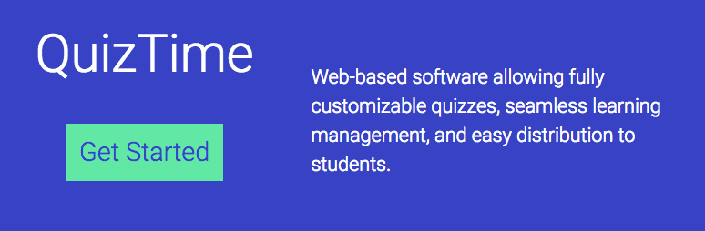

# QuizTime - Lambda-Labs 9

Pleae click [here](https://quiztime.now.sh) to view the deployed application.

Please click [here]() to view our video tutorial. 

## Team

Joseph Stossmeister | [Github](https://github.com/Jstoss)

Allen Hai | [Github](https://github.com/coetry)

Keith Kennegy | [Github](https://github.com/Kennedykid1995)

Cesar Napoleon Mejia Leiva | [Github](https://github.com/cesarnml)

Carey Baldwin | [Github](https://github.com/careybaldwin02)

Please feel free to contact us with questions about this project.

## Running

After forking this repository, the user should run $ npm install or $ yarn install in order to gain access to the necessary dependencies
 
### Back End

### Front End

