# Backend

## Table of Contents

<!-- TOC -->

- [Backend](#backend)
  - [Table of Contents](#table-of-contents)
  - [Backend Resource Links](#backend-resource-links)
  - [Database Schema on Hasura](#database-schema-on-hasura)
    - [Tables](#tables)
      - [Teacher](#teacher)
        - [Teacher Structure](#teacher-structure)
        - [Teacher Sample Data](#teacher-sample-data)
        - [Teacher Constraints](#teacher-constraints)
      - [Class](#class)
        - [Class Structure](#class-structure)
        - [Class Sample Data](#class-sample-data)
        - [Class Constraints](#class-constraints)
      - [Student](#student)
        - [Student Structure](#student-structure)
        - [Student Sample Data](#student-sample-data)
        - [Student Constraints](#student-constraints)
      - [Quiz](#quiz)
        - [Quiz Structure](#quiz-structure)
        - [Quiz Sample Data](#quiz-sample-data)
        - [Quiz Constraints](#quiz-constraints)
      - [Major_Question](#major_question)
        - [Major_Question Structure](#major_question-structure)
        - [Major_Question Constraints](#major_question-constraints)
      - [Major_Answer](#major_answer)
        - [Major_Answer Structure](#major_answer-structure)
        - [Major_Answer Constraints](#major_answer-constraints)
      - [Minor_Question](#minor_question)
        - [Minor_Question Structure](#minor_question-structure)
        - [Minor_Question Constraints](#minor_question-constraints)
      - [Minor_Answer](#minor_answer)
        - [Minor_Answer Structure](#minor_answer-structure)
        - [Minor_Answer Constraints](#minor_answer-constraints)
    - [Join/Junction Tables](#joinjunction-tables)
      - [Class_Quiz](#class_quiz)
        - [Class_Quiz Structure](#class_quiz-structure)
        - [Class_Quiz Sample Data](#class_quiz-sample-data)
        - [Class_Quiz Constraints](#class_quiz-constraints)
      - [Student_Major_Answer](#student_major_answer)
        - [Student_Major_Answer Structure](#student_major_answer-structure)
        - [Student_Major_Answer Constraints](#student_major_answer-constraints)
      - [Student_Minor_Answer](#student_minor_answer)
        - [Student_Minor_Answer Structure](#student_minor_answer-structure)
        - [Student_Minor_Answer Constraints](#student_minor_answer-constraints)
  - [GraphQL Relationships](#graphql-relationships)
    - [Models](#models)
      - [Teacher](#teacher-1)
      - [Class](#class-1)
      - [Student](#student-1)
      - [Quiz](#quiz-1)
      - [Major_Question](#major_question-1)
      - [Major_Answer](#major_answer-1)
      - [Minor_Question](#minor_question-1)
      - [Minor_Answer](#minor_answer-1)
      - [Class_Quiz](#class_quiz-1)
      - [Student_Major_Answer](#student_major_answer-1)
      - [Student_Minor_Answer](#student_minor_answer-1)

<!-- /TOC -->

## Backend Resource Links

Heroku Backend Server URL: https://dashboard.heroku.com/apps/quiztime-hasura

Hasura GraphQL Endpoint: https://quiztime-hasura.herokuapp.com/v1alpha1/graphql

## Database Schema on Hasura

### Tables

#### Teacher

##### Teacher Structure

##### Teacher Sample Data

##### Teacher Constraints

---

#### Class

##### Class Structure

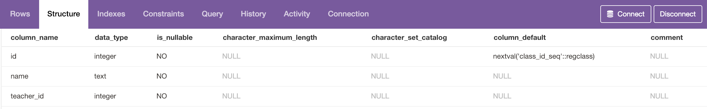

##### Class Sample Data

##### Class Constraints

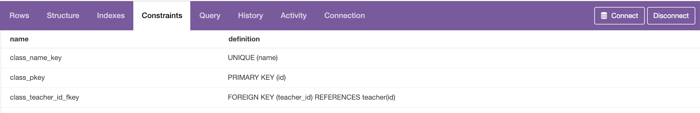

---

#### Student

##### Student Structure

##### Student Sample Data

##### Student Constraints

---

#### Quiz

##### Quiz Structure

##### Quiz Sample Data

##### Quiz Constraints

---

#### Major_Question

##### Major_Question Structure

##### Major_Question Constraints

---

#### Major_Answer

##### Major_Answer Structure

##### Major_Answer Constraints

---

#### Minor_Question

##### Minor_Question Structure

##### Minor_Question Constraints

---

#### Minor_Answer

##### Minor_Answer Structure

##### Minor_Answer Constraints

### Join/Junction Tables

#### Class_Quiz

##### Class_Quiz Structure

##### Class_Quiz Sample Data

##### Class_Quiz Constraints

---

#### Student_Major_Answer

##### Student_Major_Answer Structure

##### Student_Major_Answer Constraints

---

#### Student_Minor_Answer

##### Student_Minor_Answer Structure

##### Student_Minor_Answer Constraints

## GraphQL Relationships

### Models

#### Teacher

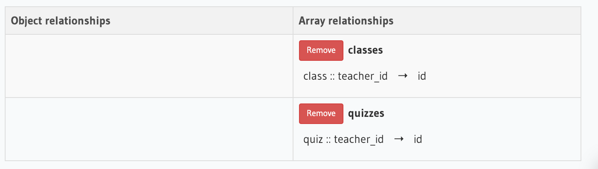

---

#### Class

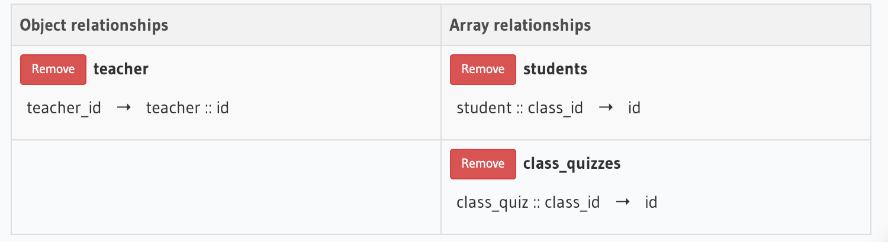

---

#### Student

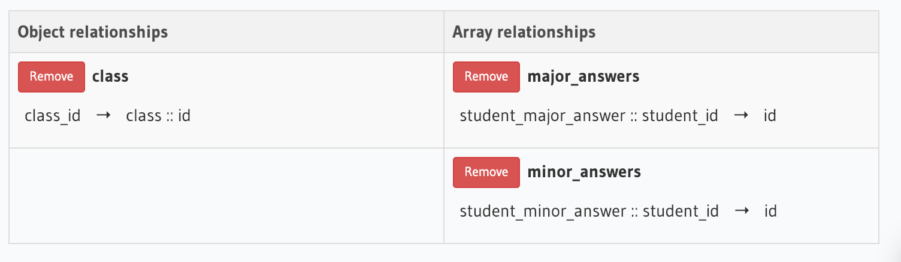

---

#### Quiz

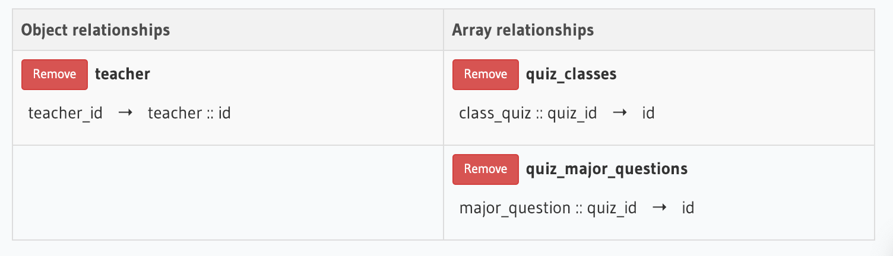

---

#### Major_Question

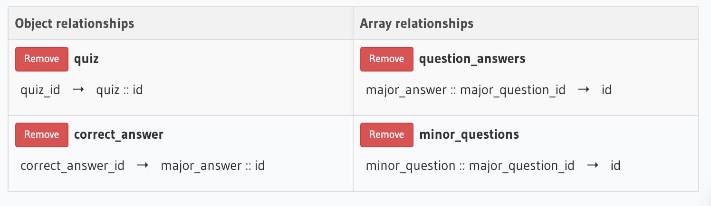

---

#### Major_Answer

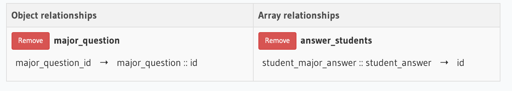

---

#### Minor_Question

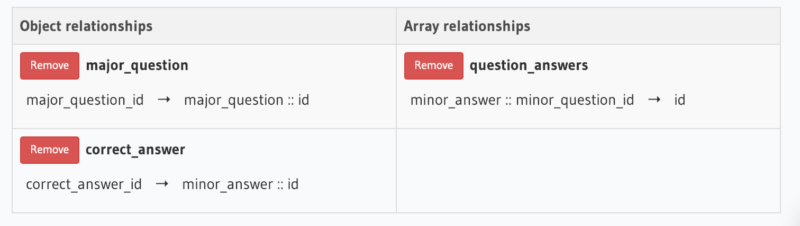

---

#### Minor_Answer

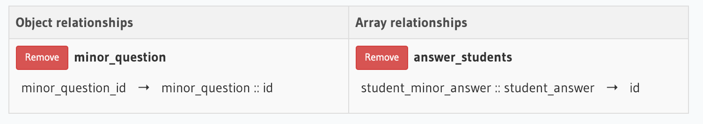

---

#### Class_Quiz

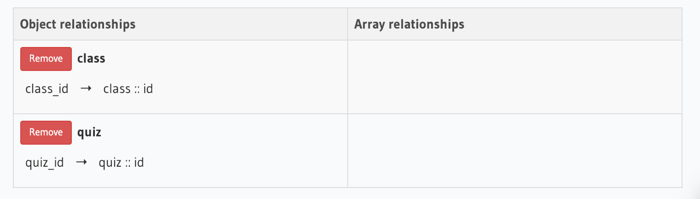

---

#### Student_Major_Answer

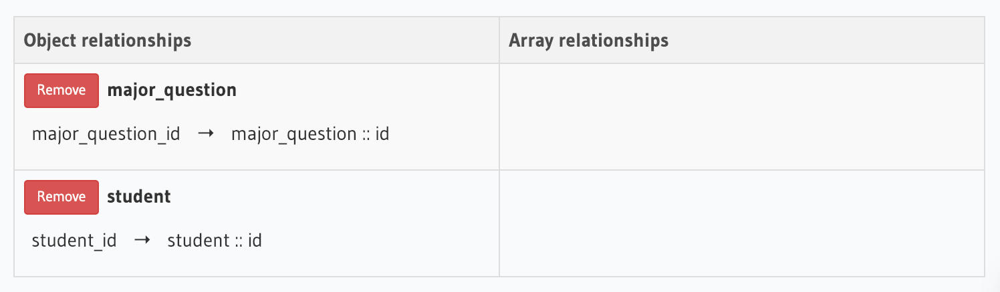

---

#### Student_Minor_Answer

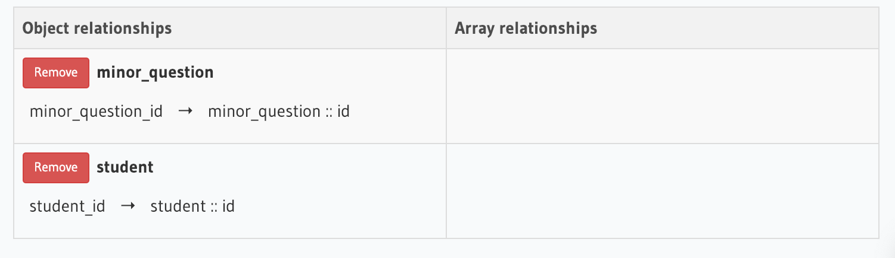
