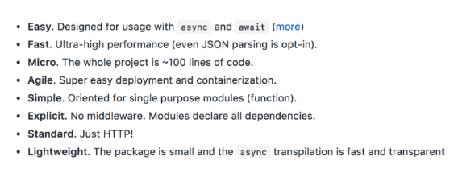

# Micro 

This document is intended to provide some background on Zeit's micro and how we have implemented it in our application.  Micro is a lightweight server written in NodeJS.  Additional information can be found at [this github page] (https://github.com/zeit/micro) and [this Zeit blog post] (https://zeit.co/blog/micro-8).

Our motivation for using micro is to enable "microservices", such as user payments.  Essentially, we build a mini server to handle payments through Stripe.  Micro's benefits include: 



We are using continuous deployment through Now, a command line tool ([more on setting up Now:] (https://zeit.co/now#get-started)).

## Getting Started with Micro

Micro is only meant to be use in production.  In development, we use micro-dev which will aid us in building microservices.

```bash
$ npm install --save micro
```
or 

```bash
$ yarn add micro
```

It will also be important to use dotenv for securing secret keys for this and other applications.

```bash
$ yarn add dotenv
```

After installation, we then need to create an index.js file and export a function that accepts standard incoming messages and server responses. (Now runs the index.js file by default).

```js
module.exports = (req, res) => {
  res.end('Welcome to Micro')
}
```
[More about helper functions available with Micro:] (https://github.com/zeit/micro#body-parsing)

Micro comes with some important modules that we may make use of.  The send module lets our server send a response and the json module lets our server parse the json data we receive from our front end-applications post request. 

Below is an example from a [Hackernoon article] (https://hackernoon.com/accept-payments-on-your-site-with-nextjs-stripe-and-micro-371de95b22d5)

```js
require('dotenv').config(); // we need our dotenv stuff
const {send, json} = require('micro');
const post = require('./post'); // we'll make this soon don't worry.
const stripe = require('stripe')(process.env.STRIPE_SECRET_KEY); // this is our stripe key! use your testing key for now.

module.exports = post(async (req, res) => {
  const data = await json(req);
  
  stripe.charges.create(data, (err, resp) => {
    if (err) {
      send(res, 400, {error: `Charge could not be created.`})
    }
    else {
      send(res, 200, {message: `Charge created.`})
    }
```

